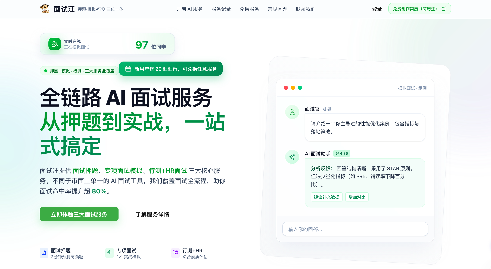

# 面试汪-前端源码

[](./README.md)
[](./README_EN.md)

**NestJS 后端源码：** https://github.com/lgd8981289/ww-server

**线上地址：** https://mianshiwangoffer.com/



个人公众号：**程序员Sunday** 分享：前端、AI 相关知识


## 项目架构

### 技术栈

- **框架层：** Nuxt 4、Vue 3、Vue Router 4
- **状态管理：** Pinia + `pinia-plugin-persistedstate`
- **UI 与样式：** `@nuxt/ui`、TailwindCSS 4、Sass
- **网络请求：** Nuxt Plugin 封装 `$api`（`$fetch`）+ SSE（`fetch + ReadableStream`）
- **工程能力：** Vite、Nitro、SVG Icons、Dayjs、本地 Dev Proxy

### 目录分层

```text
.
├── app/                        # 前端业务源码（srcDir）
│   ├── api/                    # 接口层（按业务域拆分）
│   ├── assets/                 # 静态资源（css、图片、图标）
│   ├── components/             # 通用组件 + 业务组件
│   │   ├── home/               # 首页模块
│   │   ├── interview/          # 面试主流程模块
│   │   ├── login/              # 登录模块
│   │   └── profile/            # 个人中心模块
│   ├── composables/            # 组合式能力（SEO、全局弹窗、语音播报）
│   ├── constants/              # 常量与业务配置（服务类型、SEO、限制项）
│   ├── layouts/                # 布局层（default/auth/interview）
│   ├── middleware/             # 路由中间件（auth）
│   ├── pages/                  # 页面路由层
│   ├── plugins/                # Nuxt 插件（request、analytics、svg）
│   ├── stores/                 # Pinia 状态（user/interview/ui）
│   └── utils/                  # 工具函数（STS、语音优化、限流等）
├── server/
│   └── api/                    # Nitro 服务端接口（如动态 sitemap）
├── public/                     # 公共静态资源
├── nuxt.config.js              # Nuxt/Nitro/Vite 总配置
└── ecosystem.config.js         # PM2 部署配置
```

### 核心架构设计

#### 1) 路由与布局分离

- `default`：官网信息流（首页、FAQ、联系等）
- `auth`：登录场景独立视觉与交互
- `interview`：面试业务容器（侧边栏、步骤状态、导航守卫）

#### 2) 状态驱动业务流程

- `stores/user.js`：登录态、token、用户信息、简历列表
- `stores/interview.js`：面试 3 步流程状态、会话消息、面试状态机
- `stores/ui.js`：全局 UI 状态（未登录弹窗等）

#### 3) 请求层统一收口

- `plugins/request.js` 注入全局 `$api`
  - 自动携带 token
  - 统一解包后端 `{ code, message, data }`
  - 统一处理 401/500 与 Toast 提示
- 普通 HTTP 接口统一放在 `app/api/*.js`
- SSE 场景（押题、面试流式问答）由 `app/api/interview.js` 的 `ssePost` 处理

#### 4) 面试业务主链路

1. `/interview/start`：选择岗位 + 选择简历 + 选择服务类型
2. `/interview?serviceType=xxx&step=input|progress|interview|complete`：统一承载流程
3. `step=progress`：简历押题 SSE 进度流
4. `step=interview`：专项/行测面试实时对话（可暂停/恢复/结束）
5. `/interview/report`：展示分析报告
6. `/history`：历史记录回看，支持回放到 complete/report

#### 5) 扩展能力

- SEO：`nuxt.config.js` 全局 head + `constants/seo.js` + `useSEO`
- 文件上传：STS 临时凭证 + OSS 客户端上传（简历管理）
- 语音能力：语音输入（识别优化）+ AI 文本语音播报

## 功能清单

### 已实现核心功能

- 用户登录：微信扫码登录、登录态持久化、未登录拦截提示
- 首页营销：服务介绍、功能亮点、CTA 引导
- 面试主流程：
  - 第一步：选择岗位 + 选择简历（上传/手输）
  - 第二步：选择服务并进入流程（面试押题 / 专项面试 / 行测+HR）
  - 第三步：查看结果与分析报告
- 流式能力：
  - 押题 SSE 流式进度
  - 模拟面试 SSE 实时问答
  - 语音输入 + 语音播报
- 记录体系：历史记录查询与回放
- 个人中心：用户资料、简历管理、充值记录、消费记录、旺旺币兑换
- 支付与权益：套餐充值、服务次数消耗与兑换

### 服务类型说明

| 服务类型 | 标识 | 说明 |
| --- | --- | --- |
| 面试押题 | `resume` | 基于岗位与简历生成预测题与参考答案 |
| 专项面试 | `special` | 1v1 实时模拟对话，支持暂停/恢复/结束 |
| 行测+HR | `behavior` | 综合能力评估与结构化反馈 |

## API 对接约定

### 1) 基础路径与代理

- 前端默认请求基路径：`/dev-api`
- 本地开发通过 `nuxt.config.js -> nitro.devProxy` 代理到后端服务
- 生产环境可通过 `VITE_API_BASE_URL` 覆盖

### 2) 鉴权约定

- 登录后将 token 存于 `userStore.token`
- 请求插件 `plugins/request.js` 会自动注入请求头：
  - `Authorization: Bearer <token>`
- 接口返回 401 时，前端会清理登录态并引导重新登录

### 3) 统一响应结构（HTTP 接口）

后端推荐返回：

```json
{
  "code": 200,
  "message": "ok",
  "data": {}
}
```

前端 `$api` 处理规则：
- `code === 200`：自动解包为 `data`
- 非 200：统一 toast 提示并抛出错误

### 4) SSE 接口约定

- SSE 不走 `$api`，使用 `fetch + ReadableStream`（见 `app/api/interview.js`）
- 公共封装：`ssePost(path, params, options)`
- 已使用的流式接口：
  - `POST /interview/resume/quiz/stream`
  - `POST /interview/mock/start`
  - `POST /interview/mock/answer`

### 5) 主要业务接口分层

- `app/api/login.js`：登录相关
- `app/api/user.js`：用户信息、记录查询
- `app/api/resume.js`：简历管理
- `app/api/interview.js`：面试流程、历史记录、SSE
- `app/api/payment.js`：支付下单与状态查询
- `app/api/sys.js`：STS 凭证等系统能力


## 运行方式

### 1) 环境要求

- Node.js `>= 20`（建议使用 LTS）
- 包管理器：`pnpm`（或 npm/yarn，但推荐与项目锁文件保持一致）

### 2) 安装依赖

```bash
pnpm install
```

### 3) 本地开发启动

```bash
pnpm dev
```

执行后会自动将 `.env.development` 复制为 `.env`，并启动 Nuxt 开发服务。

### 4) 后端接口联调配置（重点）

项目默认通过 `nuxt.config.js` 中的 `nitro.devProxy` 代理 `/dev-api/*` 请求。  
你需要把代理目标改成你自己的后端地址（本地或测试环境）：

```js
// nuxt.config.js
nitro: {
	devProxy: {
		'/dev-api/': {
			target: 'http://localhost:8888', // 改为你的后端地址
			changeOrigin: true,
			rewrite: (p) => p.replace(/^\/dev-api/, '')
		}
	}
}
```

后端代码仓库：`https://github.com/lgd8981289/ww-server`

### 5) 环境变量说明

项目主要通过 `runtimeConfig.public` 读取以下变量（定义见 `nuxt.config.js`）：

- `VITE_API_BASE_URL`：前端请求基础路径，默认 `/dev-api`
- `VITE_RESUME_PREVIEW_URL`：简历预览站点地址

可在 `.env.development` / `.env.production` 中维护。

### 6) 生产构建与预览

```bash
pnpm build
pnpm preview
```

说明：
- `pnpm build` 会先将 `.env.production` 复制为 `.env` 再执行构建
- `pnpm preview` 用于本地预览生产构建结果

### 7) 常见问题排查

- 页面报 401：检查登录态 token 是否正确、后端鉴权是否可用
- 接口全量失败：优先检查 `nitro.devProxy` 的 `target` 是否可达
- SSE 无数据：检查后端是否按 `text/event-stream` 返回，及反向代理是否支持流式转发
- 上传失败：检查 STS 接口与 OSS CORS/权限配置

## 提交规范

| 类型（type） | 含义                                              | 示例                                            |
| ------------ | ------------------------------------------------- | ----------------------------------------------- |
| **feat**     | 新功能（feature）                                 | `feat(user): add login button`                  |
| **fix**      | 修复 bug                                          | `fix(api): correct null pointer handling`       |
| **docs**     | 仅文档变更（documentation）                       | `docs(readme): update installation steps`       |
| **style**    | 不影响逻辑的样式变动（空格、格式、分号等）        | `style: format code with prettier`              |
| **refactor** | 重构（既不是新增功能，也不是修 bug）              | `refactor(component): simplify render logic`    |
| **perf**     | 性能优化（performance）                           | `perf(list): improve rendering performance`     |
| **test**     | 测试相关修改（添加、修改、重构测试用例）          | `test(utils): add unit tests for parseDate`     |
| **build**    | 构建系统或依赖相关变动（npm、webpack、rollup 等） | `build(deps): upgrade vite to 5.x`              |
| **ci**       | CI 配置文件或脚本变更                             | `ci(github): add lint workflow`                 |
| **chore**    | 不影响源代码的其他改动（构建脚本、工具、配置等）  | `chore: update .gitignore`                      |
| **revert**   | 回滚先前的提交                                    | `revert: revert "feat(user): add login button"` |

**补充说明：**

- **scope** 是可选的，用于标明影响的范围（如模块名、功能名）。
- 标题建议不超过 **50 个字符**，首字母小写，不加句号。
- 一次 commit 只对应一种 `type`，以保证提交历史清晰可读。
